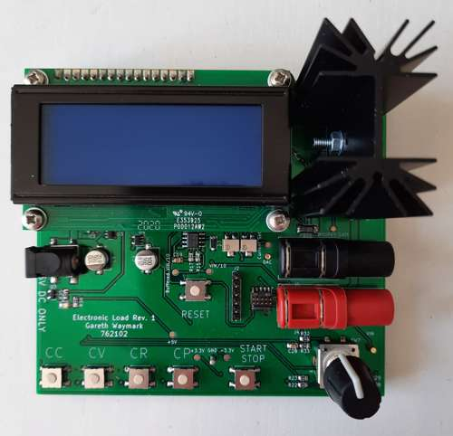
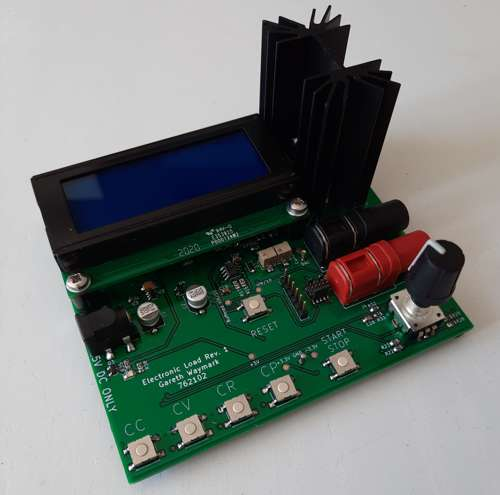

# University Individual Project
# Electronic DC Load
## Introduction
For my third year individual project I decided to design and build an 
electronic DC load. I felt this project gave me plenty of opportunities to
demonstrate many different skills in electronic design including firmware,
analogue design and PCB design.

## Specification
The primary aim was to achieve a high level of current draw accuracy. The load
can be set to sink from 0 to 2047 mA in 1 mA increments.
The total power dissipation capability is 10W. Voltage input to the test
terminals is up to 30V.

## Features
The load has four modes of operation: constant current, constant voltage,
constant resistance and constant power. These are selectable using the push
buttons along the lower edge of the board.

## How does it work
The load uses a MOSFET as the power dissipating element. This is mounted to
a passive aluminium heat sink. 

Current flowing through the MOSFET is measured by a 100mOhm shunt resistor.
This voltage is compared to a setting voltage provided by the microcontroller
using a DAC. An OPA277 op-amp adjusts the gate voltage on the MOSFET to
maintain a steady current.

An STM32G071CB Cortex M0+ microcontroller was used to manage the analogue
control loop. Voltage and current was also measured by the MCU and used to
provide real time power dissipation information. FreeRTOS was used to ensure
a reliable software control loop could execute alongside user input and an LCD
display.

## Tools
I use Linux as my daily operating system. I tried to use open source tools
where possible including:
- ARM GCC Compiler toolchain
- JLink debugger
- GDB
- Kicad
- NGSpice
- GNU Octave

